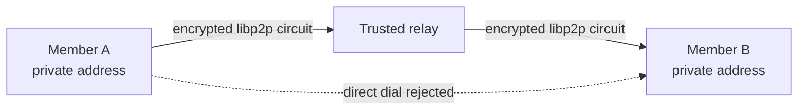

# Security and privacy

## Supported deployment profile

Peerless is designed for permissioned meshes. A node must be initialised with
`peerless init` or install a signed invitation with `peerless join` before the
normal listener or the public `Peerless::start` API will run. The
`--unsafe-open` switch exists only for isolated tests; do not use it on a LAN or
WAN.

For deployments where an application peer must not learn another peer's IP
address, use `peerless start-relayed` with one or more independently operated
relays. This mode accepts only circuit addresses
and disables ambient discovery, Identify, AutoNAT, and DCUtR. It never upgrades a relayed
connection to a direct connection.

The application peer sees the other peer's persistent pseudonymous Node ID and
signed actions, but not its direct IP address. The relay necessarily sees the
network addresses of both endpoints. This is source-address privacy from other
application peers, not anonymity from the relay or a global traffic observer.
Achieving the latter requires independently operated multi-hop mix/onion
routing, cover traffic, and a separate threat model; Peerless does not claim
that property.

## Implemented controls

- Ed25519 identities and signed, versioned protocol envelopes.
- Both request and response signing keys must match the authenticated libp2p
  transport peer, preventing replay through a different connection identity.
- Signed permission certificates, persisted issued-member authorization, live
  expiry checks, and rejection of non-members.
- QUIC or Noise transport encryption.
- Relay-only privacy mode that requires a loopback base listener, accepts
  circuits only through configured relays, and rejects direct listeners,
  addresses, and dials.
- Ambient mDNS discovery is not compiled; peers enter through explicit signed
  invitation/bootstrap addresses or a persisted peer cache.
- Wasmtime execution without host imports, with a 512 MiB maximum memory limit
  and a finite instruction-fuel budget.
- Per-identity and global RPC windows, at most 32 concurrent RPC streams,
  bounded pending/established connections, and per-peer connection limits.
- Bounded content size, chunk size, concurrent uploads, in-flight bytes, and
  task slots.
- Blind task admission: exact CPU, RAM, storage, runtime inventory, load,
  power, and slot measurements are never returned over the wire. Signed
  requesters learn only whether a concrete task is accepted or rejected.
- Bounded parallel shard execution spreads application working sets across
  isolated executors without exposing cross-host pointers or shared process
  memory.
- Bounded peer-cache, membership, CRDT, and ledger reads; peer-cache sequence
  decoding stops at its entry cap instead of allocating the full input.
- Crash-safe atomic persistence with exclusive temporary files, `fsync`,
  private creation modes, and cross-store CRDT file locking/merge.
- Kademlia provider publication waits for protocol completion before content is
  advertised as fetchable.
- Content-address verification, signed results, replay/idempotency checks, and
  membership-aware ledger validation.
- Identity directories are `0700`; key files are `0600`; symlink keys and
  symlink identity directories are rejected.
- The Docker runtime uses UID/GID 10001, a read-only root filesystem, all Linux
  capabilities dropped, `no-new-privileges`, and memory/PID/CPU limits.

## Operational requirements

1. Keep node data on encrypted storage and protect backups. File permissions do
   not protect a key after the host administrator or running process is
   compromised.
2. Use a firewall. Expose only the selected relay endpoint; never publish the
   direct QUIC listener when source-address privacy is required.
3. Operate the relay separately from application peers and treat its connection
   metadata as sensitive. Prefer a relay operator that is not the data owner.
4. When a device or key is lost, finalize and gossip a consensus-approved
   `NodeRevoked` ledger event. A node applies a finalized revocation
   immediately, persists it in the ledger, and enforces it after restart.
   Collecting the required member approvals is an operator responsibility.
5. Run the complete gate before release: `./scripts/e2e.sh`.

The audit gate ignores RUSTSEC-2026-0118 and RUSTSEC-2026-0119 only because
libp2p 0.56 lists optional mDNS crates in `Cargo.lock`; the `mdns` feature is
disabled and `cargo tree --target all -i libp2p-mdns` has no compiled path.

## Residual risks

No software can guarantee that hacking is impossible. In particular, Peerless
does not protect a node after host/root compromise, does not hide traffic from
its configured relay or a global observer, and does not yet provide hardware-
backed keys or an automated multi-party revocation ceremony. Security fixes in
Rust, Wasmtime, libp2p, and transitive dependencies must be applied promptly.

Signed application peers still see a persistent pseudonymous Node ID. Direct
P2P peers necessarily see each other's network endpoint. Relay-only mode hides
that endpoint from the other application peer, but the selected relay sees both
ends. Blind admission prevents bulk capability disclosure; repeated real task
offers can still reveal coarse facts through accept/reject outcomes and are
therefore membership- and rate-limited.

Report suspected vulnerabilities privately to the repository owner. Do not
include live private keys, invitations, private addresses, or user data in a
public issue.
